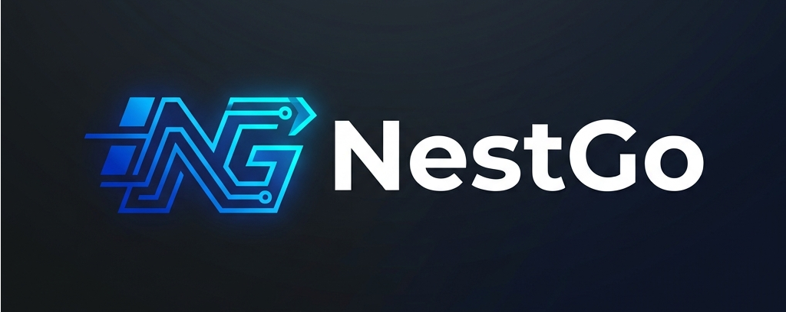
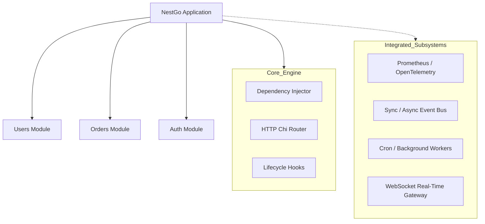

<div align="center">
  

  <h1>🚀 NestGo Framework</h1>

  <p><b>A Next-Generation, Production-Grade Backend Architecture for Go</b></p>
  
  <p>
    <a href="https://golang.org/doc/devel/release.html"></a>
    <a href="https://github.com/Ashishkapoor1469/Nestgo"></a>
    <a href="https://github.com/go-chi/chi"></a>
    <a href="https://opensource.org/licenses/MIT"></a>
  </p>

  <p>
    <em>Inspired by the brilliant developer experience of NestJS, built from the ground up with Idiomatic Go. Zero reflection magic. Absolute type safety. Massive performance.</em>
  </p>
</div>

---

## 🌟 Philosophy & Vision

While micro-frameworks like `chi`, `fiber`, and `gin` are fantastic for routing, they leave large-scale architectural layout entirely to the developer. As applications grow to dozens of modules running complex pipelines, "do-it-yourself" architectures often break down into spaghetti code and unstable DI cycles.

**NestGo** solves this by providing the structural maturity and conventions of Enterprise frameworks (like NestJS or Spring Boot), while strictly adhering to Go's philosophy:
- **No Runtime Reflection Magic**: We use explicit interfaces and pure Go functions for constructor-based dependency injection.
- **Strictly Typed**: Compile-time safe dependencies; if your graph is broken, your build fails instantly.
- **Convention Over Configuration**: A highly opinionated structure powered by a brilliant CLI tool.

---

## 🔥 Key Features

| Category | Capability |
|---|---|
| **🏗 Modular Architecture** | Built-in module system with topological dependency resolution (DAG) and cycle detection. |
| **💉 Explicit DI Container** | Constructor-based dependency injection supporting Singleton and Request lifecycles. |
| **🛡 Advanced Pipelines** | Enterprise middleware, RBAC Guards, Response Interceptors, and centralized Exception Filters. |
| **🚀 High Performance** | Lightning fast native routing built on [Chi](https://github.com/go-chi/chi). |
| **🛠 Developer CLI** | `nestgo` binary for 1-click project scaffolding, vertical slicing (`generate resource`), and hot-reloading (`nestgo dev`). |
| **⚙️ Observability Core** | Built-in plugins for Prometheus metrics, zero-allocation structured JSON logging (`slog`), and advanced health endpoints. |

---

## 📦 Built-In Infrastructure Support

NestGo understands what modern backend systems actually need before they go to production.



---

## 🚀 Quick Start

### 1. Install the CLI Architecture Globally
The heart of the developer experience is the CLI. Grab it globally:

```bash
go install github.com/Ashishkapoor1469/Nestgo/cmd/nestgo@latest
```

The CLI natively integrates with your shell. Enable autocompletions for extreme speed:
```bash
# Add to your shell profile (~/.bashrc, ~/.zshrc)
source <(nestgo completion bash)
# OR
source <(nestgo completion zsh)
```

### 2. Scaffold Your Next Big Idea
Create a perfectly structured new project in under 3 seconds:

```bash
nestgo new my-app
cd my-app
nestgo dev  # Starts the hot-reloading development server
```

### 3. Generate a Resource
Need a fully wired CRUD slice? Generate the Controller, Service, DTOs, and tests instantly:

```bash
nestgo generate resource products
```

---

## 🧠 The Anatomy of a NestGo App

### 1. Controllers (The Presentation Layer)
Controllers in NestGo implement a simple interface. They define paths and register route definitions explicitly to avoid reflection lookups.

```go
import (
    "github.com/Ashishkapoor1469/Nestgo/common"
)

type UserController struct {
    service *UserService // Automatically injected!
}

func (c *UserController) Prefix() string {
    return "/users"
}

func (c *UserController) Routes() []common.Route {
    return []common.Route{
        {Method: "GET", Path: "/", Handler: c.FindAll},
        {Method: "POST", Path: "/", Handler: c.Create},
    }
}

func (c *UserController) FindAll(ctx *common.Context) error {
    return ctx.Paginated(c.service.GetUsers()) // Fluent context API
}
```

### 2. Services (The Business Logic)
Providers and Services are clean structs instantiated through pure Go constructor functions.

```go
type UserService struct {
    db *database.Client
}

// The DI Container analyzes this signature and injects *database.Client
func NewUserService(db *database.Client) *UserService {
    return &UserService{db: db}
}
```

### 3. Modules (The Dependency Graph)
Modules form the boundaries of your architecture, wrapping up controllers and services to expose them safely to the Application container.

```go
import (
    "github.com/Ashishkapoor1469/Nestgo/common"
    "github.com/Ashishkapoor1469/Nestgo/di"
)

type UsersModule struct{}

func (m *UsersModule) Module() common.ModuleConfig {
    service := NewUserService()
    controller := NewUserController(service)

    return common.ModuleConfig{
        Name:        "users",
        Controllers: []common.Controller{controller},
        Providers: []di.Provider{
            {Instance: service},
        },
    }
}
```

### 4. Bootstrap (The Launchpad)
The initialization code is elegantly chained, allowing configuration overrides via functional options.

```go
func main() {
    app := core.New(
        core.WithAddress(":8080"),
        core.WithGlobalPrefix("/api/v1"),
    )
    
    // Register the root module
    app.RegisterModule(&app_module.AppModule{})
    
    // Liftoff 🚀
    log.Fatal(app.Start())
}
```

---

## 🛠️ Diagnostics & Tooling

To ensure your repository stays impeccably clean as it scales out to hundreds of developers, run zero-configuration diagnostics:

```bash
# Verify your application health, test coverage, and catch anti-patterns
nestgo doctor

# Visualize your entire dependency graph layout
nestgo graph
```

## 📜 License
Distributed under the MIT License. See `LICENSE` for more information.

<div align="center">
    Made with ❤️ by the NestGo Community.
</div>
